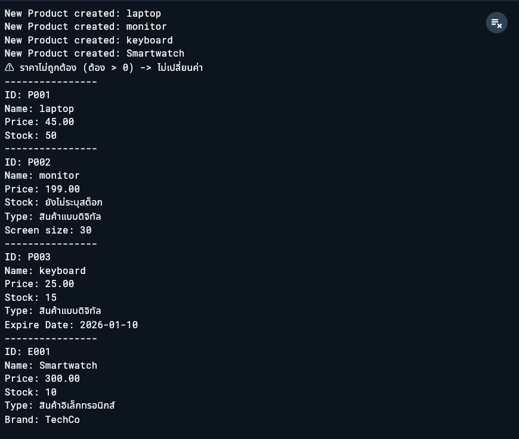

# Lab Dart03: OOP ระบบจัดการสินค้า (Product Management System)
### 67543210044-3 ภานุวัฒน์ ต๋าคำ

โปรแกรมจัดการสินค้าอย่างง่ายในภาษา Dart ที่สาธิตหลักการเขียนโปรแกรมเชิงวัตถุ (OOP) เช่น Encapsulation, Inheritance, และ Polymorphism

## 🎯 เป้าหมาย และ ข้อกำหนดงาน

1.  สร้างโปรแกรมที่สามารถสร้างสินค้า, แสดงข้อมูล, และปรับราคา/ส่วนลดได้
2.  ซ่อนข้อมูลสำคัญด้วย private properties (`_`)
3.  ตรวจสอบความถูกต้องของข้อมูลด้วย Getters/Setters
4.  ใช้ Inheritance และ Polymorphism เพื่อรองรับสินค้าหลายประเภท

### ข้อกำหนดงาน
  1) Class แม่: Product
   * Properties:
       * _id (String) → private
       * name (String) → public
       * price (double) → public (ห้ามเป็น null)
       * stock (int?) → nullable (อาจไม่ระบุสต็อกตอนแรกได้)
   * Constructor:
       * ใช้ named parameters และ required สำหรับ id, name, price
   * Getter/Setter:
       * getter: id เพื่ออ่าน _id
       * setter: price
           * ต้องมากกว่า 0 เท่านั้น ถ้าค่าไม่ถูกต้องให้ “ไม่เปลี่ยน” และพิมพ์เตือน
   * Methods:
       * applyDiscount(double percent)
           * percent ต้องอยู่ระหว่าง 0–100 เท่านั้น
           * ลดราคาตามเปอร์เซ็นต์
       * restock(int amount)
           * ถ้า stock เป็น null ให้ถือว่าเริ่มจาก 0
           * เพิ่มจำนวนสินค้าเข้า stock
       * showInfo()
           * แสดงข้อมูลสินค้า
           * ถ้า stock เป็น null ให้แสดง “ยังไม่ระบุสต็อก”
  2) Class ลูก: DigitalProduct (extends Product)
   * เพิ่ม property:
       * fileSizeMB (double) → required
   * override method:
       * showInfo() ให้แสดงเพิ่มว่าเป็น “สินค้าแบบดิจิทัล” และแสดง fileSizeMB

  3) Class ลูก: FoodProduct (extends Product)
   * เพิ่ม property:
       * expireDate (String) → required (เช่น "2026-01-10")
   * override method:
       * showInfo() ให้แสดงเพิ่มว่าเป็น “สินค้าอาหาร” และแสดงวันหมดอายุ

  4) Polymorphism
   * ใน main() ให้ทำ:
       1. สร้างสินค้าอย่างน้อย 3 ชิ้น (ต้องมีทั้ง Product, DigitalProduct, และ FoodProduct)
       2. เก็บลง List<Product>
       3. วนลูปเรียก showInfo() ของแต่ละชิ้น (ให้เห็นการ override ทำงาน)


### ตัวอย่างพฤติกรรมที่ต้องทำได้
*	ลดราคา 10%
*	เพิ่มสต็อก +50
*	ทดลองตั้งราคาเป็นค่าติดลบแล้วต้อง “ถูกป้องกัน”
*	ถ้า stock ยังไม่กำหนด ให้แสดงข้อความแทน null

## ✨ ฟีเจอร์หลัก

*   **Encapsulation:** ใช้ Private property (`_id`) พร้อม Getter เพื่อป้องกันการแก้ไข ID และมี Setter (`updatePrice`) สำหรับ `price` เพื่อควบคุมความถูกต้องของข้อมูล
*   **Inheritance:** มี Class แม่ (`Product`) และ Class ลูกที่สืบทอดคุณสมบัติไปใช้ (`DigitalProduct`, `ItEquipment`, `ElectronicProduct`)
*   **Polymorphism:** สามารถจัดเก็บ Object ของ Class ลูกทั้งหมดไว้ใน List ของ Class แม่ (`List<Product>`) และเรียกใช้ Method ที่ถูก Override (`showInfo`) ได้อย่างถูกต้อง
*   **Logic Verification:** มีระบบตรวจสอบความถูกต้องของข้อมูล เช่น ราคาต้องไม่ติดลบ และเปอร์เซ็นต์ส่วนลดต้องอยู่ระหว่าง 0-100

---

## 🏗️ โครงสร้างคลาส (Class Structure)

### 1. Class แม่: `Product`

เป็นคลาสพื้นฐานสำหรับสินค้าทุกประเภท

*   **Properties:**
    *   `final String _id` (Private)
    *   `String name`
    *   `double price`
    *   `int? stock` (Nullable)
*   **Methods:**
    *   `applyDiscount(double percent)`: คำนวณและลดราคาสินค้าตามเปอร์เซ็นต์
    *   `restock(int amount)`: เพิ่มจำนวนสินค้าในสต็อก
    *   `showInfo()`: แสดงรายละเอียดสินค้าพื้นฐาน

### 2. Class ลูก (Sub-classes)

แต่ละคลาสจะสืบทอด (`Inherit`) ความสามารถจาก `Product` และเพิ่มคุณลักษณะเฉพาะตัว:

*   **`DigitalProduct`**: เพิ่ม `double screenSize` (ขนาดหน้าจอ)
*   **`ItEquipment`**: เพิ่ม `String expireDate` (วันหมดอายุการรับประกัน)
*   **`ElectronicProduct`**: เพิ่ม `String brand` (แบรนด์สินค้า)

---

## 🚀 วิธีการใช้งาน

### การสร้าง Instance และใช้งาน Method

```dart
// สร้างสินค้าใหม่
ElectronicProduct e1 = ElectronicProduct(
  id: "E001",
  name: "Smartwatch",
  price: 300,
  stock: 10,
  brand: "TechCo",
);

// การปรับปรุงราคา (ผ่าน Setter ที่มีการตรวจสอบ)
// หากใส่ราคาติดลบจะถูกป้องกัน
e1.updatePrice = -50; // แสดงข้อความเตือน

// การลดราคา 10%
e1.applyDiscount(10);

// แสดงข้อมูล
e1.showInfo();
```

### การใช้ Polymorphism

สามารถจัดการสินค้าทุกประเภทพร้อมกันได้ผ่านการวนลูป List ของ Class แม่:

```dart
// สร้าง List ที่เก็บสินค้าประเภทต่างๆ
List<Product> inventory = [p1, d1, f1, e1];

// วนลูปเพื่อแสดงข้อมูลของสินค้าแต่ละชิ้น
// Dart จะเรียกใช้ showInfo() ของ Class ลูกที่ถูก Override โดยอัตโนมัติ
for (var item in inventory) {
  item.showInfo();
}
```

---

## 🛠️ รายละเอียดเทคนิคที่ใช้

*   **Named Parameters:** ใช้ `{required ...}` ใน Constructor เพื่อให้โค้ดอ่านง่ายและบังคับให้ใส่ค่าที่จำเป็น
*   **Null Safety:** ใช้ `int? stock` และเครื่องหมาย `??` เพื่อจัดการกรณีสินค้าที่อาจไม่มีการระบุจำนวนสต็อก
*   **Method Overriding:** ใช้ `@override` ใน Class ลูกเพื่อปรับปรุงการทำงานของ `showInfo()` ให้เหมาะสมกับประเภทสินค้านั้นๆ
*   **String Interpolation & Formatting:** ใช้ `toStringAsFixed(2)` เพื่อจัดรูปแบบราคาให้มีทศนิยม 2 ตำแหน่งเสมอ

##  ผลลัพธ์
- 

## โค้ดทั้งหมด
```dart
// 1) Class แม่
class Product {
  final String _id; // Private property
  String name;
  double price;
  int? stock;

  // Constructor ด้วย named parameters และ required
  Product({
    required String id,
    required this.name,
    required this.price,
    this.stock,
  }) : _id = id;

  // Getter สำหรับอ่านค่า _id
  String get id => _id;

  // Setter สำหรับตรวจสอบราคา
  set updatePrice(double newPrice) {
    if (newPrice > 0) {
      price = newPrice;
    } else {
      print("⚠️ ราคาไม่ถูกต้อง (ต้อง > 0) -> ไม่เปลี่ยนค่า");
    }
  }

  // Method ลดราคา
  void applyDiscount(double percent) {
    if (percent >= 0 && percent <= 100) {
      price -= (price * percent / 100);
    } else {
      print("⚠️ เปอร์เซ็นต์ส่วนลดต้องอยู่ระหว่าง 0-100");
    }
  }

  // Method เพิ่มสต็อก
  void restock(int amount) {
    stock = (stock ?? 0) + amount;
  }

  // Method แสดงข้อมูล
  void showInfo() {
    print("----------------");
    print("ID: $_id");
    print("Name: $name");
    print("Price: ${price.toStringAsFixed(2)}");
    print("Stock: ${stock ?? 'ยังไม่ระบุสต็อก'}");
  }
}

// 2) Class ลูก
class DigitalProduct extends Product {
  double screenSize; // Changed from Screen_size to screenSize

  DigitalProduct({
    required String id,
    required String name,
    required double price,
    int? stock,
    required this.screenSize, // Changed from Screen_size to screenSize
  }) : super(id: id, name: name, price: price, stock: stock);

  @override
  void showInfo() {
    super.showInfo();
    print("Type: สินค้าแบบดิจิทัล");
    print("Screen size: $screenSize"); // Changed from Screen_size to screenSize
  }
}

// 3) Class ลูก
// Renamed IT_equipment to ItEquipment to follow UpperCamelCase convention.
class ItEquipment extends Product {
  String expireDate;

  ItEquipment({
    required String id,
    required String name,
    required double price,
    int? stock,
    required this.expireDate,
  }) : super(id: id, name: name, price: price, stock: stock);

  @override
  void showInfo() {
    super.showInfo();
    print("Type: สินค้าแบบดิจิทัล");
    print("Expire Date: $expireDate");
  }
}

// 4) Class ลูก
class ElectronicProduct extends Product {
  String brand;

  ElectronicProduct({
    required String id,
    required String name,
    required double price,
    int? stock,
    required this.brand,
  }) : super(id: id, name: name, price: price, stock: stock);

  @override
  void showInfo() {
    super.showInfo();
    print("Type: สินค้าอิเล็กทรอนิกส์");
    print("Brand: $brand");
  }
}

// 5) Main Function & Polymorphism
void main() {
  // สร้างสินค้าแต่ละประเภท
  Product p1 = Product(id: "P001", name: "laptop", price: 50, stock: 0);
  DigitalProduct d1 = DigitalProduct(
    id: "P002",
    name: "monitor",
    price: 199,
    screenSize: 30.0,
  );
  // Changed IT_equipment to ItEquipment
  ItEquipment f1 = ItEquipment(
    id: "P003",
    name: "keyboard",
    price: 25,
    stock: 15,
    expireDate: "2026-01-10",
  );
  ElectronicProduct e1 = ElectronicProduct(
    id: "E001",
    name: "Smartwatch",
    price: 300,
    stock: 10,
    brand: "TechCo",
  );

  print("New Product created: ${p1.name}");
  print("New Product created: ${d1.name}");
  print("New Product created: ${f1.name}");
  print("New Product created: ${e1.name}");

  // ทดสอบระบบป้องกันราคาติดลบ (Setter)
  p1.updatePrice = -100;

  // ทดสอบการลดราคาและเพิ่มสต็อก
  p1.applyDiscount(10); // ลด 10% จาก 50 เหลือ 45
  p1.restock(50);

  // เก็บสินค้าลง List เพื่อทำ Polymorphism
  List<Product> inventory = [p1, d1, f1, e1]; // เพิ่ม e1 เข้าไปใน inventory

  // วนลูปเรียก showInfo()
  for (var item in inventory) {
    item.showInfo();
  }
}

```